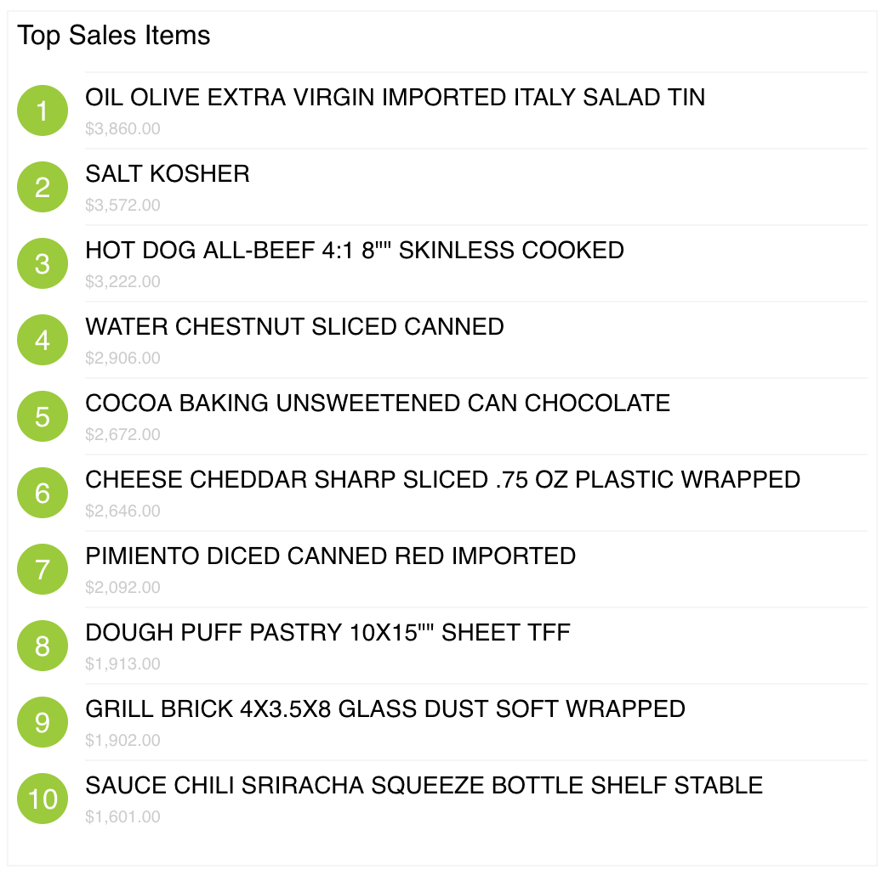

# HotSchedules Front-end Engineering Challenge

## React App Screenshot

## Angular App

note: see ng project

Angular follows a Component based architecture, so migrating from React --> Angular is a simple task, involving the
replacement of decorators and annotations at the top of the component files. Angular does contain some nice things
by default, like pipes which can be used with currencies.

## jQuery App

note: see jQuery project

Making this compatible with an exiting jQuery based application would involve copying the markup from the render function
into the appropriate html file. The javascript could be attached as <script> tags. An ajax call would retrieve the data set
and append list items to an ordered list.

## Narrative 

After realizing the user experience of their application suite is disjointed, shadowy upper-management figures
have bestowed the task of unifying them to you! You have decided there can only be one solution: you must build
a component library! The complexity grows as you ponder the problem; the Russian team uses Angular.js for their app,
the Columbian team uses React.js for theirs, and the hipster dev team in SF decided to use nothing but jQuery. How will
you form a comprimise to pacify all the share holders??? 

## Task

Though the execs want to see a full fledged library completed by end of quarter, they really just need to get one
component released to production for all the apps ASAP to apease a large customer. Typical. The component in question is 
a list which displays a customer's top selling items. Your job will be to create the component, keeping in mind it has to work
in a variety of environments.

Your product manager provides you with the requirements:

1. Display the top 10 selling products in order from most sold to least. 
2. Display the revenue of each product.

Your star designer provides you with awesome mocks:

[Mocks](https://drive.google.com/file/d/0B7KmJIsOVjr6YTcwMC11bTBnVGs/view?usp=sharing)

(Don't stress on being pixel perfect.)

Your backend team exposes an api:

* The route '/PurchaseOrders' returns the latest PurchaseOrders
* Each PurchaseOrder has an array of products PurchaseOrder.products
* each Product has an order_count and vendor_price property which can be used to calculate revenue

*hint* - revenue = Product.order_count * (Product.vendor_price.value / Product.vendor_price.scale)

*note* - You will notice vendor_price is an object with three properties: code, value, and scale. Code
is the type of currency. For performance reasons we don't save numbers with decimal points in the database. Instead,
the scale property holds the exponent of 10 by which to divide the value property by. So for example,
{value: 1000, scale: 2} is equivalent to 1000 / 10^2 => 1000 / 100 => $10.00.

## Getting Started 

Clone this repo.

`git clone git@bitbucket.org:redbookplatform/frontend-challenge.git`

Install. Set up npm if needed (http://blog.teamtreehouse.com/install-node-js-npm-mac).

`npm install`

Install global packages

`npm install webpack -g`

`npm install json-server -g`

Start your mock server

`json-server --watch ./data/db.json`

In separate terminal window use webpack to build your library as well as sandbox app.  

Webpack is a module bundler that bundles all your code into one file and compiles it
from Javascript ES6 to Javascript ES5.

`npm run build`

The build will re-run everytime you update your source.  

Write the TopSalesList component in 'src/top-sales-list'.

You can write a utility function to help transform the data from the server to a format more
conducive to your component if needed in 'src/utils/'.

